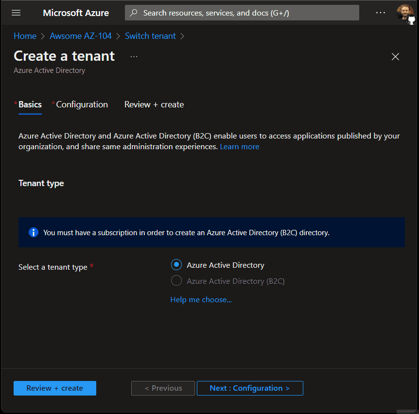

# Awsome AZ-104

A curated collection of AZ-104 certification statements accompanied by references and demos.

- **Statements** are derived from real exam questions
- **References** are the evidence for the statement
- **Demos** to see statements in action

Only statements that are directly related to exam questions are added to this collection.

## Azure Active Directory (AAD)

### New Tenant User Management

Existing AAD admins (Global Administrators, User Administrators, Owners) of an existing Tenant A must be added to a newly created Tenant B before they're able to manage users of that new Tenant B. The only user which will have instant management permissions is the administrator that created the new Tenant B.

Reference: [Add Users to Active Directory](https://docs.microsoft.com/en-us/azure/active-directory/fundamentals/add-users-azure-active-directory?view=azure-devops)

  
Azure Portal Demo

  As we can see in this example, none of the existing users of Tenant A are added to the new Tenant B upon it's creation, with the exception of the Tenant B creator.

  </img>

## Load Balancer (LB / ILB, ELB)

### Load Balancer Least Privilege Permissions

For an administrator to be able to create Backend Pools on ELBs and Health Probes on ILBs the minimum permission that they'll need is `Network Contributor` on those resources AND in the Virtual Network.

**Demo: [demos/lb/lb-least-privilege](demos/lb/lb-least-privilege)**

The reason being that a change on the subnet is also required, as demonstrated in the following exception.

  
Exception
\
  <pre>
    <code>
    Message: The client 'Admin1@yourdomain.onmicrosoft.com' with object id '00000' has permission to perform action 'Microsoft.Network/loadBalancers/write' on scope '/subscriptions/00000/resourceGroups/rg-awsomeaz104-loadbalancer-permissions-demo/providers/Microsoft.Network/loadBalancers/lbi-awsomeaz104-loadbalancer-permissions-demo'; however, it does not have permission to perform action 'Microsoft.Network/virtualNetworks/subnets/join/action' on the linked scope(s) '/subscriptions/00000/resourceGroups/rg-awsomeaz104-loadbalancer-permissions-demo/providers/Microsoft.Network/virtualNetworks/vnet-awsomeaz104-loadbalancer-permissions-demo/subnets/LBI-Subnet' or the linked scope(s) are invalid.
    </code>
  </pre>

In the experiment the following output was reproduced, this of course given that the Virtual Network resides on the same Resource Group.

| Target | Assignment | Scope | Action | Result | Least   Privilege | 
|------------|-------|--------|--------|:-:|:-----------------:|
| ELB | Contributor | External Load Balancer | Add Backend Pool | ❌ | ❌ |
| ELB | Network Contributor | External Load Balancer | Add Backend Pool | ❌ | ❌ |
| ELB | Network Contributor | Resource Group | Add Backend Pool | ✅ | ✅ |
| ELB | Owner | External Load Balancer | Add Backend Pool | ❌ | ❌ |
| ILB | Contributor | Internal Load Balancer | Add Health Probe | ❌ | ❌ |
| ILB | Network Contributor | Internal Load Balancer | Add Health Probe | ❌ | ❌ |
| ILB | Network Contributor | Resource Group | Add Health Probe | ✅ | ✅ |
| ILB | Owner | Internal Load Balancer | Add Health Probe | ❌ | ❌ |