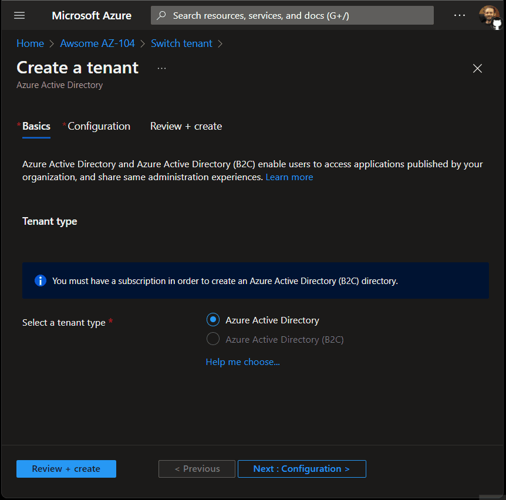

# New Tenant User Management

Existing AAD admins (Global Administrators, User Administrators, Owners) of an existing Tenant A must be added to a newly created Tenant B before they're able to manage users of that new Tenant B. The only user which will have instant management permissions is the administrator that created the new Tenant B.

Reference: [Add Users to Active Directory](https://docs.microsoft.com/en-us/azure/active-directory/fundamentals/add-users-azure-active-directory?view=azure-devops)

As we can see in this example, none of the existing users of Tenant A are added to the new Tenant B upon it's creation, with the exception of the Tenant B creator.

</img>
