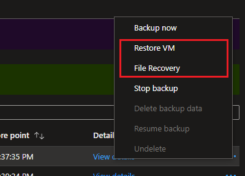
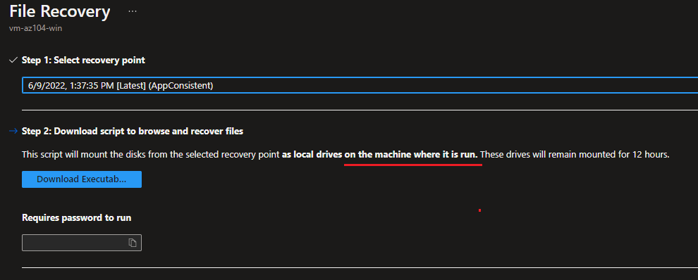
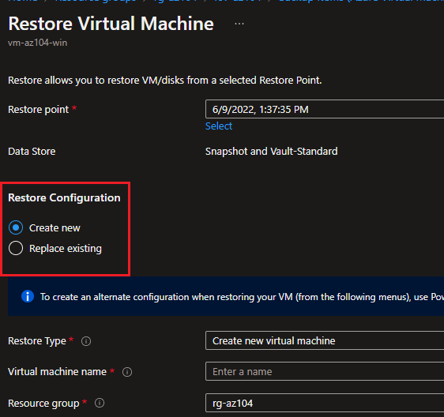

# Recover Windows Backup

This example will implement the options available when working with backups for both VM and files.
- Options to restore a VM
- Options to restore files from a backed-up VM

```sh
az group create -n 'rg-az104' -l 'brazilsouth'
az backup vault create -l 'brazilsouth' --name 'rsv-az104' -g 'rg-az104'

az vm create -n 'vm-az104-win' -g 'rg-az104' \
  --image 'Win2022Datacenter' \
  --admin-user 'azureuser' \
  --admin-password 'AwsomeAz104!'
```

Enable the VM backup:

```sh
az backup protection enable-for-vm \
  --resource-group 'rg-az104' \
  --vault-name 'rsv-az104' \
  --vm 'vm-az104-win' \
  --policy-name 'DefaultPolicy'
```

Create the first backup:

```sh
az backup protection backup-now \
  --container-name 'iaasvmcontainerv2;rg-az104;vm-az104-win' \
  --item-name 'vm-az104-win' \
  --resource-group 'rg-az104' \
  --retain-until '01-02-2025' \
  --vault-name 'rsv-az104' \
  --backup-management-type 'AzureIaasVM'
```

Upon completion of the backup, two options wil be available:

- Restore VM
- File Recovery



When restoring files, they can be recovered any where that the script is run.



When restoring the VM, it can be either replace existing, or to a new one.


