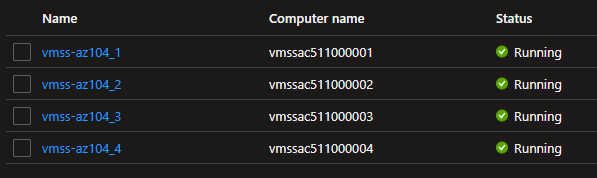
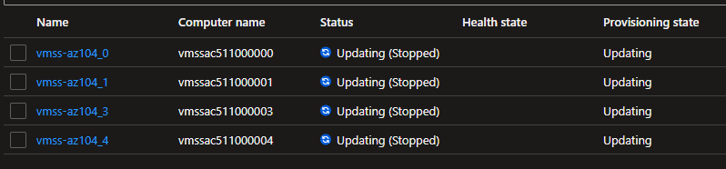

# Change VMSS Size

When changing a Scale Set VM size, all VMs will restart at the same time.

```sh
az vmss create \
  -n 'vmss-az104' \
  -g 'rg-az104' \
  --instance-count 4 \
  --image 'UbuntuLTS' \
  --admin-username 'azureuser' \
  --admin-password 'SecretPassAz104!' \
  --vm-sku 'Standard_B1s' \
  --enable-auto-update 'true' \
  --upgrade-policy-mode 'Automatic'
```

Once created all VM's will be in a running state:



Now change the size:

```sh
az vmss update -n 'vmss-az104' -g 'rg-az104' --vm-sku 'Standard_B1ms'
```

All VMs will be upgraded automatically at the same time.


