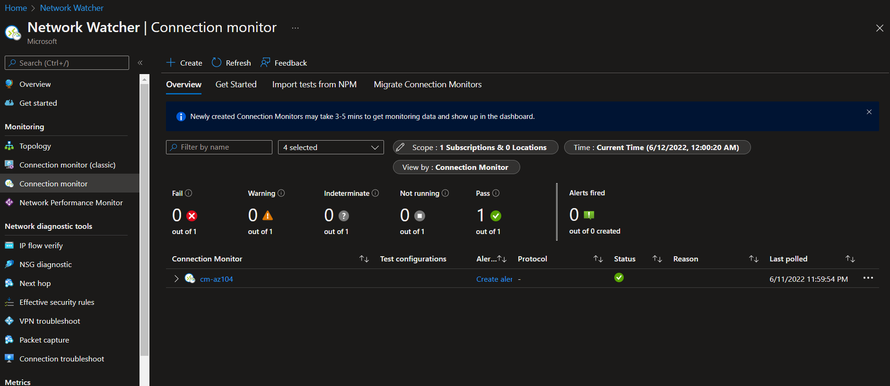
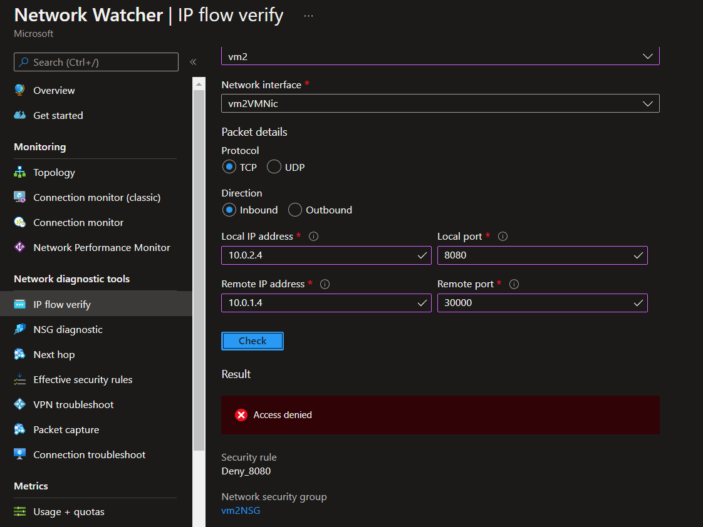
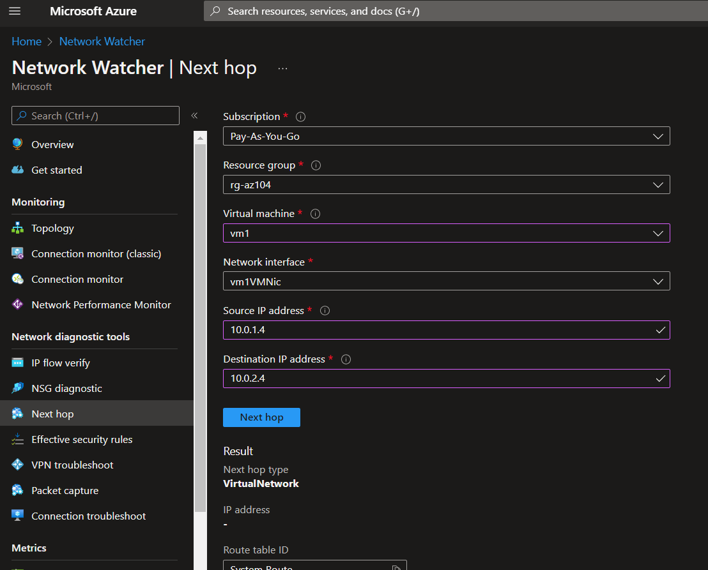
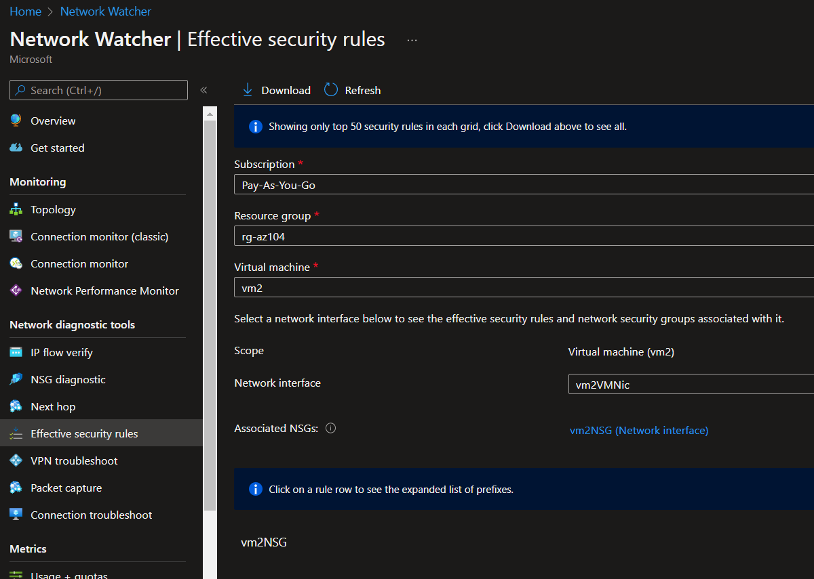
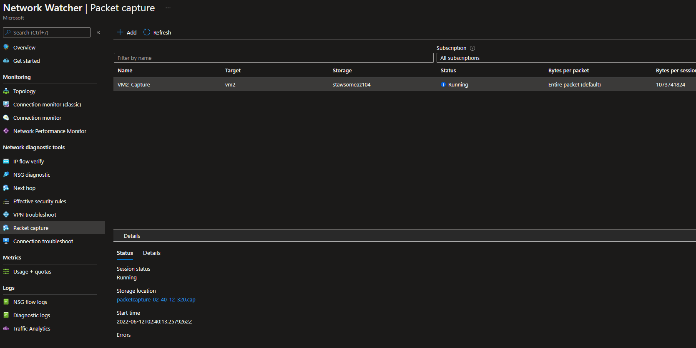
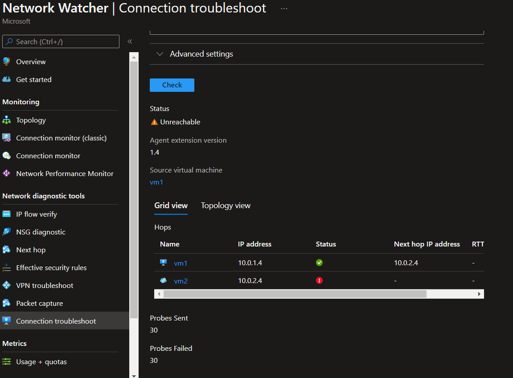

# Network Watcher

This small session demonstrates Network Watcher resources.

Create the network components:

```sh
az group create -l 'brazilsouth' -n 'rg-az104'

az network vnet create -g 'rg-az104' -n 'VNet1' --address-prefixes '10.0.0.0/16'

az network vnet subnet create -g 'rg-az104' --vnet-name 'VNet1' -n 'Subnet1' --address-prefixes '10.0.1.0/24'
az network vnet subnet create -g 'rg-az104' --vnet-name 'VNet1' -n 'Subnet2' --address-prefixes '10.0.2.0/24'

az vm create -n 'vm1' -g 'rg-az104' --image 'UbuntuLTS' --vnet-name 'VNet1' --subnet 'Subnet1'
az vm extension set -g 'rg-az104' --vm-name 'vm1' --name 'NetworkWatcherAgentLinux' --publisher 'Microsoft.Azure.NetworkWatcher'

az vm create -n 'vm2' -g 'rg-az104' --image 'UbuntuLTS' --vnet-name 'VNet1' --subnet 'Subnet2'
az vm extension set -g 'rg-az104' --vm-name 'vm2' --name 'NetworkWatcherAgentLinux' --publisher 'Microsoft.Azure.NetworkWatcher'
```

## Connection Monitor

Connection monitor is a centralized health probe tool that allows you to constantly verify the state various services.



## IP Flow Verify

> Network Watcher IP flow verify checks if a packet is allowed or denied to or from a virtual machine based on 5-tuple information. The security group decision and the name of the rule that denied the packet is returned.

The following command for IP Flow will verify the connectivity VM1 -> VM2, from VM2 inbound perspective.

```sh
az network watcher test-ip-flow \
  -g 'rg-az104' \
  --direction 'Inbound' \
  --protocol 'TCP' \
  --local '10.0.2.4:8080' \
  --remote '10.0.1.4:30000' \
  --vm 'vm2'
```

Now to demonstrate a **Deny** rule:

```sh
az network nsg rule create -g 'rg-az104' --nsg-name 'vm2NSG' -n 'Deny_8080' --priority '100' \
  --source-address-prefixes '10.0.1.4' --source-port-ranges '*' \
  --destination-address-prefixes '10.0.2.4' --destination-port-ranges '80' '8080' --access 'Deny' \
  --protocol 'Tcp' --description 'Deny from specific IP address ranges on 80 and 8080.'
```
If you run IP Flow again it will fail.

```sh
az network watcher test-ip-flow -g 'rg-az104' --direction 'Inbound' --protocol 'TCP' --local '10.0.2.4:8080' --remote '10.0.1.4:30000' --vm 'vm2'

# {
#   "access": "Deny",
#   "ruleId": "/subscriptions/2ea97ae3-d129-41fb-a4ca-eb56ad392d35/resourceGroups/rg-az104/providers/Microsoft.Network/networkSecurityGroups/vm2NSG/securityRules/Deny_8080",
#   "ruleName": "securityRules/Deny_8080"
# }
```

Portal view:



To the delete the rule:

```sh
az network nsg rule delete -g 'rg-az104' --nsg-name 'vm2NSG' -n 'Deny_8080'
```

## NSG Diagnostic

> The Network Security Group (NSG) Diagnostics tool provides detailed information to understand and debug the security configuration of your network. For a given source-destination pair, the API returns all NSGs that will be traversed, the rules that will be applied in each NSG and the final allow/deny status for the flow.

```sh
az network watcher run-configuration-diagnostic \
  --resource 'vm2' \
  --resource-type 'virtualMachines' \
  --resource-group 'rg-az104'\
  --direction 'Inbound' \
  --protocol 'TCP' \
  --source '10.0.1.4' \
  --destination '10.0.2.4' \
  --port '8080'
```

View from the portal:


## Next Hop

> Next Hop provides the next hop from the target virtual machine to the destination IP address.

```sh
az network watcher show-next-hop -g 'rg-az104' --vm 'vm1' --source-ip '10.0.1.4' --dest-ip '10.0.2.4'
```

Portal view:




## Effective Security Rules

This will display the security rules applied.



## VPN Troubleshoot

> Network Watcher VPN Troubleshoot diagnoses the health of the virtual network gateway or connection.

TODO: Requires a VPN Gateway for testing

## Packet Capture

You'll need a storage for this.

```sh
az storage account create -g 'rg-az104' -n 'stawsomeaz104' --sku 'Standard_LRS'
```

Now create the package capture:

```sh
az network watcher packet-capture create \
  -g 'rg-az104' \
  -n 'VM2_Capture' \
  --vm 'vm2' \
  --storage-account 'stawsomeaz104' \
  --time-limit '3600'
```

Packets will be written to the storage.



## Connection Troubleshoot

> Network Watcher Connection Troubleshoot provides the capability to check a direct TCP connection from a virtual machine (VM) to a VM, fully qualified domain name (FQDN), URI, or IPv4 address.




