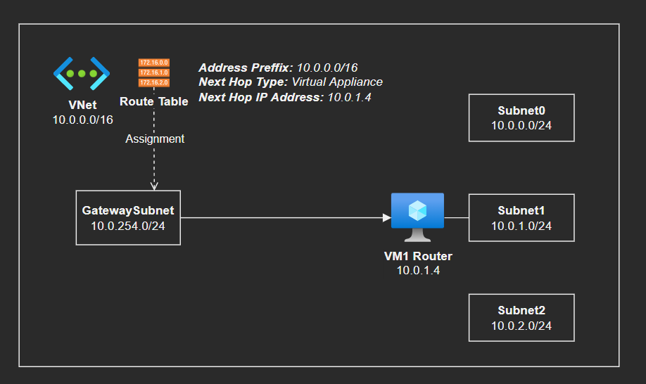

# Routing Tables

This exercise demonstrate how to implement a route table that routes traffic coming from a VPN Gateway to a specific subnet NVA.



First create the starter infrastructure.

```sh
az group create -l 'brazilsouth' -n 'rg-az104'

az network vnet create -g 'rg-az104' -n 'VNet1' --address-prefixes '10.0.0.0/16'

az network vnet subnet create -g 'rg-az104' --vnet-name 'VNet1' -n 'Subnet0' --address-prefixes '10.0.0.0/24'
az network vnet subnet create -g 'rg-az104' --vnet-name 'VNet1' -n 'Subnet1' --address-prefixes '10.0.1.0/24'
az network vnet subnet create -g 'rg-az104' --vnet-name 'VNet1' -n 'Subnet2' --address-prefixes '10.0.2.0/24'
az network vnet subnet create -g 'rg-az104' --vnet-name 'VNet1' -n 'GatewaySubnet' --address-prefixes '10.0.254.0/24'

# This is a simulation of a Router server
az vm create -n 'vm-az104-router' -g 'rg-az104' --image 'UbuntuLTS' --vnet-name 'VNet1' --subnet 'Subnet1'

az network route-table create -g 'rg-az104' -n 'RT'
```

Now you need to route ALL TRAFFIC where the destination is the very own VNet, and that comes from the Gateway, to be routed to the VM1 router in Subnet1.

```sh
# 1 - Create the route for the above requirement
az network route-table route create \
  -g 'rg-az104' \
  -n 'GatewayToNVA_Route' \
  --route-table-name 'RT' \
  --address-prefix '10.0.0.0/16' \
  --next-hop-type 'VirtualAppliance' \
  --next-hop-ip-address '10.0.1.4'

# 2 - Assign it to the Gateway networks
az network vnet subnet update -g 'rg-az104' --vnet-name 'VNet1' -n 'Subnet1' --route-table 'RT'
```